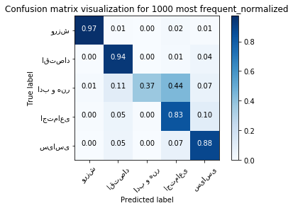
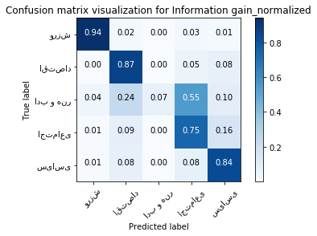
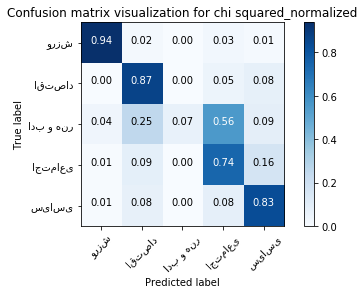
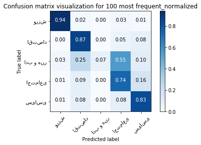

# Text Classification
In this project, we used 3 different metrics (Information Gain, Mutual Information, Chi Squared) to find important words for document classification. 


Each document can be represented by the set of its words. <br>
But some words are more important and has more effect and more meaning. These words can be used for determining the context of a document. <br>
In this part, we are going to find a set of 100 words that are more infomative for __document classification__. <br>


## Data Set
The dataset for this task is "همشهری" (Hamshahri) that contains 8600 persian documents. 

## Preproceesing
We did some preprocessing for building our data structures for processing. <br>
We read each document and added its words to our vocabulary set. We also made a set for that document.<br>
We then used this set to create a vocab_index dictionary for assigning an index for each word that appears in our dataset. <br>
Our dataset consists of 5 different classes.<br>


```python
import matplotlib.pyplot as plt
import numpy as np
import pandas as pd
import nltk
import sys
```


```python
vocab = set()
doc_vocab = []
number_of_terms = 0
number_of_docs = 0
class_dictionary = {}
cls_index = 0
doc_clss_index = []
count_of_that_class = [] 
class_name=[]

with open('data.txt', 'r', encoding="utf8") as infile:
    for line in infile:
        number_of_docs +=1
        cls, sep, text = line.partition('@@@@@@@@@@')
        #assigning class index for each document
        if (class_dictionary.get(cls))==None:
            class_dictionary[cls]=cls_index 
            tmp = cls_index
            cls_index+=1
            count_of_that_class.append(1)
            class_name.append(cls)
            
        else:
            tmp = class_dictionary[cls]
            count_of_that_class[tmp] +=1
        doc_clss_index.append(tmp)
        tokens= nltk.word_tokenize(text)
        tmp_set = set()
        number_of_terms += len(tokens)
        for word in tokens:
            vocab.add(word)
            tmp_set.add(word)
        doc_vocab.append(tmp_set)
```


```python
class_name
```


    ['ورزش', 'اقتصاد', 'ادب و هنر', 'اجتماعی', 'سیاسی']


There is some statistcs information about out dataset.


```python
print("vocab size:", len(vocab))
print ("number of terms (all tokens):", number_of_terms)
print ("number of docs:", number_of_docs)
print ("number of classes:", cls_index)
```

    vocab size: 65880
    number of terms (all tokens): 3506727
    number of docs: 8600
    number of classes: 5
    


```python
vocab_size = len(vocab)
number_of_classes = cls_index
count_of_that_class = np.asarray(count_of_that_class)
probability_of_classess = count_of_that_class / number_of_docs
```

The probability of each classes are stored in the table below.


```python
tmp_view = pd.DataFrame(probability_of_classess)
tmp_view
```


<div>
<style>
    .dataframe thead tr:only-child th {
        text-align: right;
    }

    .dataframe thead th {
        text-align: left;
    }

    .dataframe tbody tr th {
        vertical-align: top;
    }
</style>
<table border="1" class="dataframe">
  <thead>
    <tr style="text-align: right;">
      <th></th>
      <th>0</th>
    </tr>
  </thead>
  <tbody>
    <tr>
      <th>0</th>
      <td>0.232558</td>
    </tr>
    <tr>
      <th>1</th>
      <td>0.255814</td>
    </tr>
    <tr>
      <th>2</th>
      <td>0.058140</td>
    </tr>
    <tr>
      <th>3</th>
      <td>0.209302</td>
    </tr>
    <tr>
      <th>4</th>
      <td>0.244186</td>
    </tr>
  </tbody>
</table>
</div>


```python
word_occurance_frequency = np.zeros(vocab_size, dtype=int)
word_occurance_frequency_vs_class = np.zeros((vocab_size, number_of_classes), dtype=int)
```


```python
word_index = {}
counter = -1
vocab_list = []
for word in vocab:
    counter+=1
    word_index[word]=counter
    vocab_list.append(word)
vocab_list = np.asarray(vocab_list)
```


```python
for i in range(0, number_of_docs):
    for word in doc_vocab[i]:
        index = word_index[word]
        word_occurance_frequency[index]+=1
        word_occurance_frequency_vs_class[index][doc_clss_index[i]] +=1
```

    calculating probabilities


```python
p_w = word_occurance_frequency/number_of_docs
p_w_not = 1 - p_w
p_c = probability_of_classess

p_class_condition_on_w = np.zeros((number_of_classes, vocab_size), dtype=float)
tmp = word_occurance_frequency_vs_class.T
for i in range(0, number_of_classes):
    p_class_condition_on_w[i] = tmp[i]/word_occurance_frequency


p_class_condition_on_not_w = np.zeros((number_of_classes, vocab_size), dtype=float)
for i in range(0, number_of_classes):
    p_class_condition_on_not_w[i] = (count_of_that_class[i]-tmp[i])/(number_of_docs-word_occurance_frequency)
```

   # Calculation  of our metrics for each words in Vocabulary
   We are going to find 100 words that are good indicator of classes. <br>
   We want to use 3 different type of metrics  
   > -  Information Gain  
   > -  Mutual Information  
   > -  $\chi$ square   
   
   

## Information Gain
The top 10 words with highest information gain can be seen in the table below.


```python
word_ig_information = []
e_0 = 0.0
for c_index in range(0, number_of_classes):
    e_0+=p_c[c_index]*np.log2(p_c[c_index])
e_0 = -e_0
for w_index in range(0,vocab_size):
    e_1 = 0.0
    for c_index in range(0, number_of_classes):
        tmp1 = p_class_condition_on_w[c_index][w_index]
        if tmp1 !=0:
            e_1 += p_w[w_index]*tmp1*np.log2(tmp1)
        tmp2 = p_class_condition_on_not_w[c_index][w_index]
        if tmp2 !=0:
            e_1 += (1-p_w[w_index])*(tmp2*np.log2(tmp2))
    e_1 = -e_1
    
    information_gain = e_0 - e_1
    
   
    
    word_ig_information.append([information_gain, vocab_list[w_index]])
    
word_ig_information = sorted(word_ig_information, key=lambda x: x[0], reverse=True)
```


```python
preview = pd.DataFrame(word_ig_information)
preview.columns=['information_gain', 'word']
```


```python
preview.head(10)
```


<div>
<style>
    .dataframe thead tr:only-child th {
        text-align: right;
    }

    .dataframe thead th {
        text-align: left;
    }

    .dataframe tbody tr th {
        vertical-align: top;
    }
</style>
<table border="1" class="dataframe">
  <thead>
    <tr style="text-align: right;">
      <th></th>
      <th>information_gain</th>
      <th>word</th>
    </tr>
  </thead>
  <tbody>
    <tr>
      <th>0</th>
      <td>0.612973</td>
      <td>ورزشی</td>
    </tr>
    <tr>
      <th>1</th>
      <td>0.516330</td>
      <td>تیم</td>
    </tr>
    <tr>
      <th>2</th>
      <td>0.297086</td>
      <td>اجتماعی</td>
    </tr>
    <tr>
      <th>3</th>
      <td>0.293313</td>
      <td>سیاسی</td>
    </tr>
    <tr>
      <th>4</th>
      <td>0.283891</td>
      <td>فوتبال</td>
    </tr>
    <tr>
      <th>5</th>
      <td>0.267878</td>
      <td>اقتصادی</td>
    </tr>
    <tr>
      <th>6</th>
      <td>0.225276</td>
      <td>بازی</td>
    </tr>
    <tr>
      <th>7</th>
      <td>0.223381</td>
      <td>جام</td>
    </tr>
    <tr>
      <th>8</th>
      <td>0.197755</td>
      <td>قهرمانی</td>
    </tr>
    <tr>
      <th>9</th>
      <td>0.177807</td>
      <td>اسلامی</td>
    </tr>
  </tbody>
</table>
</div>


If you think about the meaning of these words you can agree that since they a have high information gain they can be really good identifiers for categorizing a doc. <br>
In the table below, you can see 5 worst words.


```python
preview.tail(5)
```


<div>
<style>
    .dataframe thead tr:only-child th {
        text-align: right;
    }

    .dataframe thead th {
        text-align: left;
    }

    .dataframe tbody tr th {
        vertical-align: top;
    }
</style>
<table border="1" class="dataframe">
  <thead>
    <tr style="text-align: right;">
      <th></th>
      <th>information_gain</th>
      <th>word</th>
    </tr>
  </thead>
  <tbody>
    <tr>
      <th>65875</th>
      <td>0.000042</td>
      <td>تبهکاران</td>
    </tr>
    <tr>
      <th>65876</th>
      <td>0.000042</td>
      <td>پذیرفتم</td>
    </tr>
    <tr>
      <th>65877</th>
      <td>0.000041</td>
      <td>توقف</td>
    </tr>
    <tr>
      <th>65878</th>
      <td>0.000031</td>
      <td>سلمان</td>
    </tr>
    <tr>
      <th>65879</th>
      <td>0.000027</td>
      <td>چهارمحال</td>
    </tr>
  </tbody>
</table>
</div>


## Mutual Information
We found two formulas for this metrics. The first one only calculates the MI in the case that w = 1, ci = 1. The second one calculates all 4 possible combinations of (w, ci) and multiplies them by their probabilities.  <br>
We used both of them and then choose the better set. <br> 
Let's see the result of each of those different formulas.

### First Formula   
The formula is:


The result for this formula


```python
word_mi_information= []
for w_index in range(0,vocab_size):
    mi_list = []
    for c_index in range(0, number_of_classes):
        N = number_of_docs
        N_1_1=word_occurance_frequency_vs_class[w_index][c_index]
        N_1_0=word_occurance_frequency[w_index]-N_1_1
        N_0_1= count_of_that_class[c_index] - N_1_1
        N_0_0= (N - count_of_that_class[c_index]) - N_1_0
        mi = 0
        if (N_1_1!=0):
            mi += np.log2((N*N_1_1)/((N_1_1+N_1_0)*(N_0_1+N_1_1)))
        
            
#         tmp = np.array([[N_1_1,N_1_0], [N_0_1, N_0_0]])
#         print (tmp, '\n')
        mi_list.append(mi)
    
    mi_list = np.asarray(mi_list)
    average = np.sum(mi_list * probability_of_classess)
    max_mi = np.max(mi_list)
    max_index = np.argmax(mi_list)
    word_mi_information.append([average, max_mi, class_name[max_index], vocab_list[w_index]])
    

word_mi_information = sorted(word_mi_information, key=lambda x: x[0], reverse=True)
```


```python
preview = pd.DataFrame(word_mi_information)
preview.columns=['mutual information(MI)', 'main class MI', 'main_class', 'word']
```


```python
preview.head(10)
```


<div>
<style>
    .dataframe thead tr:only-child th {
        text-align: right;
    }

    .dataframe thead th {
        text-align: left;
    }

    .dataframe tbody tr th {
        vertical-align: top;
    }
</style>
<table border="1" class="dataframe">
  <thead>
    <tr style="text-align: right;">
      <th></th>
      <th>mutual information(MI)</th>
      <th>main class MI</th>
      <th>main_class</th>
      <th>word</th>
    </tr>
  </thead>
  <tbody>
    <tr>
      <th>0</th>
      <td>0.524418</td>
      <td>1.782409</td>
      <td>ادب و هنر</td>
      <td>مایکروسافت</td>
    </tr>
    <tr>
      <th>1</th>
      <td>0.524418</td>
      <td>1.782409</td>
      <td>ادب و هنر</td>
      <td>باغات</td>
    </tr>
    <tr>
      <th>2</th>
      <td>0.524418</td>
      <td>1.782409</td>
      <td>ادب و هنر</td>
      <td>نباریدن</td>
    </tr>
    <tr>
      <th>3</th>
      <td>0.524191</td>
      <td>1.703799</td>
      <td>اقتصاد</td>
      <td>آلیاژی</td>
    </tr>
    <tr>
      <th>4</th>
      <td>0.524191</td>
      <td>1.703799</td>
      <td>اقتصاد</td>
      <td>دادمان</td>
    </tr>
    <tr>
      <th>5</th>
      <td>0.524191</td>
      <td>1.703799</td>
      <td>اقتصاد</td>
      <td>فرازها</td>
    </tr>
    <tr>
      <th>6</th>
      <td>0.524191</td>
      <td>1.703799</td>
      <td>اقتصاد</td>
      <td>سیاتل</td>
    </tr>
    <tr>
      <th>7</th>
      <td>0.521680</td>
      <td>1.782409</td>
      <td>ادب و هنر</td>
      <td>سخیف</td>
    </tr>
    <tr>
      <th>8</th>
      <td>0.521680</td>
      <td>1.782409</td>
      <td>ادب و هنر</td>
      <td>کارناوال</td>
    </tr>
    <tr>
      <th>9</th>
      <td>0.521680</td>
      <td>1.782409</td>
      <td>ادب و هنر</td>
      <td>تحتانی</td>
    </tr>
  </tbody>
</table>
</div>


#### <font color=red>But there is a __problem__ here  
The words in the above table are __infrequent__  words.<br>
They can give us high information in the case that they appear in our text. But when they __do not appear__ in our document, the absence of those words __do not give__ us any information about the class. So these words are only useful for those documents that have these words. So for most of the documents, these words are not useful.<br>
It seems like it is important to consider the frequency of different cases of (w, ci) and also its mutual information. <br>
    
You can see the number of occurrences of some of these words in each class:


```python
word_occurance_frequency_vs_class[word_index['نباریدن']], word_occurance_frequency_vs_class[word_index['مایکروسافت']],  word_occurance_frequency_vs_class[word_index['آلیاژی']]
```


    (array([0, 4, 1, 0, 0]), array([0, 4, 1, 0, 0]), array([0, 5, 1, 0, 0]))


```python
word_mi_information_model_1=word_mi_information
```

### Second Model
In the second model, the above problem is solved because we multiplied the frequency of different cases (probability) by its mutual information. 

The Second formula is:


```python
word_mi_information= []
for w_index in range(0,vocab_size):
    mi_list = []
    for c_index in range(0, number_of_classes):
        N = number_of_docs
        N_1_1=word_occurance_frequency_vs_class[w_index][c_index]
        N_1_0=word_occurance_frequency[w_index]-N_1_1
        N_0_1= count_of_that_class[c_index] - N_1_1
        N_0_0= (N - count_of_that_class[c_index]) - N_1_0
        mi = 0.0
        if (N*N_1_1)!=0:
            mi += (N_1_1/N)*np.log2((N*N_1_1)/((N_1_1+N_1_0)*(N_0_1+N_1_1)))
        if (N*N_0_1)!=0:
            mi += (N_0_1/N)*np.log2((N*N_0_1)/((N_0_1+N_0_0)*(N_0_1+N_1_1)))
        if (N*N_1_0)!=0:
            mi += (N_1_0/N)*np.log2((N*N_1_0)/((N_1_1+N_1_0)*(N_0_0+N_1_0)))
        if (N*N_0_0)!=0:
            mi += (N_0_0/N)*np.log2((N*N_0_0)/((N_0_1+N_0_0)*(N_0_0+N_1_0)))
#         tmp = np.array([[N_1_1,N_1_0], [N_0_1, N_0_0]])
#         print (tmp, '\n')
        mi_list.append(mi)
    
    mi_list = np.asarray(mi_list)
    average = np.sum(mi_list * probability_of_classess)
    max_mi = np.max(mi_list)
    max_index = np.argmax(mi_list)
    word_mi_information.append([average, max_mi, class_name[max_index], vocab_list[w_index]])
    

word_mi_information = sorted(word_mi_information, key=lambda x: x[0], reverse=True)
```


```python
preview = pd.DataFrame(word_mi_information)
preview.columns=['mutual information(MI)', 'main class MI', 'main_class', 'word']
```


```python
preview.head(10)
```


<div>
<style>
    .dataframe thead tr:only-child th {
        text-align: right;
    }

    .dataframe thead th {
        text-align: left;
    }

    .dataframe tbody tr th {
        vertical-align: top;
    }
</style>
<table border="1" class="dataframe">
  <thead>
    <tr style="text-align: right;">
      <th></th>
      <th>mutual information(MI)</th>
      <th>main class MI</th>
      <th>main_class</th>
      <th>word</th>
    </tr>
  </thead>
  <tbody>
    <tr>
      <th>0</th>
      <td>0.202674</td>
      <td>0.606665</td>
      <td>ورزش</td>
      <td>ورزشی</td>
    </tr>
    <tr>
      <th>1</th>
      <td>0.173929</td>
      <td>0.512590</td>
      <td>ورزش</td>
      <td>تیم</td>
    </tr>
    <tr>
      <th>2</th>
      <td>0.099833</td>
      <td>0.279402</td>
      <td>ورزش</td>
      <td>فوتبال</td>
    </tr>
    <tr>
      <th>3</th>
      <td>0.094818</td>
      <td>0.258578</td>
      <td>سیاسی</td>
      <td>سیاسی</td>
    </tr>
    <tr>
      <th>4</th>
      <td>0.088517</td>
      <td>0.232945</td>
      <td>اقتصاد</td>
      <td>اقتصادی</td>
    </tr>
    <tr>
      <th>5</th>
      <td>0.085858</td>
      <td>0.265246</td>
      <td>اجتماعی</td>
      <td>اجتماعی</td>
    </tr>
    <tr>
      <th>6</th>
      <td>0.076582</td>
      <td>0.209092</td>
      <td>ورزش</td>
      <td>بازی</td>
    </tr>
    <tr>
      <th>7</th>
      <td>0.076098</td>
      <td>0.217883</td>
      <td>ورزش</td>
      <td>جام</td>
    </tr>
    <tr>
      <th>8</th>
      <td>0.070387</td>
      <td>0.195426</td>
      <td>ورزش</td>
      <td>قهرمانی</td>
    </tr>
    <tr>
      <th>9</th>
      <td>0.056253</td>
      <td>0.155666</td>
      <td>ورزش</td>
      <td>بازیکن</td>
    </tr>
  </tbody>
</table>
</div>


#### These words are better
They are not __rare__ <br> 
You can see the frequency of some of these words in each classes:


```python
print (list(reversed(class_name)))
word_occurance_frequency_vs_class[word_index['ورزشی']], word_occurance_frequency_vs_class[word_index['سیاسی']],  word_occurance_frequency_vs_class[word_index['پیروزی']],
```

    ['سیاسی', 'اجتماعی', 'ادب و هنر', 'اقتصاد', 'ورزش']
    


    (array([1866,    9,    8,   66,   16]),
     array([  35,  300,   71,  372, 1602]),
     array([497,  44,  24,  60, 191]))


## $ \chi$ Squared
Another Metric is $ \chi$ Squared. <br>
Now we are goind to see the result of using $\chi$ squared as a mesure of importance.


```python
word_chi_information= []
for w_index in range(0,vocab_size):
    chi_list = []
    for c_index in range(0, number_of_classes):
        N = number_of_docs
        N_1_1=word_occurance_frequency_vs_class[w_index][c_index]
        N_1_0=word_occurance_frequency[w_index]-N_1_1
        N_0_1= count_of_that_class[c_index] - N_1_1
        N_0_0= (N - count_of_that_class[c_index]) - N_1_0
        chi = 0.0
        chi += N
        
        chi /= (N_1_1+N_0_1)
        
        tmp1 =(N_1_1*N_0_0)-(N_0_1*N_1_0)
        chi *= tmp1
        chi /=(N_1_0+N_0_0)
        chi /=(N_1_1+N_1_0)
        
        chi *= tmp1
        chi /= (N_0_0+N_1_0)

        chi_list.append(chi)

    chi_list = np.asarray(chi_list)
    average = np.sum(chi_list * probability_of_classess)
    max_chi = np.max(chi_list)
    max_index = np.argmax(chi_list)
    word_chi_information.append([average, max_chi, class_name[max_index], vocab_list[w_index]])


word_chi_information = sorted(word_chi_information, key=lambda x: x[0], reverse=True)
```


```python
preview = pd.DataFrame(word_chi_information)
preview.columns=['chi squared ', 'main class chi', 'main_class', 'word']
```


```python
preview.head(10)
```


<div>
<style>
    .dataframe thead tr:only-child th {
        text-align: right;
    }

    .dataframe thead th {
        text-align: left;
    }

    .dataframe tbody tr th {
        vertical-align: top;
    }
</style>
<table border="1" class="dataframe">
  <thead>
    <tr style="text-align: right;">
      <th></th>
      <th>chi squared</th>
      <th>main class chi</th>
      <th>main_class</th>
      <th>word</th>
    </tr>
  </thead>
  <tbody>
    <tr>
      <th>0</th>
      <td>2234.591600</td>
      <td>7376.515420</td>
      <td>ورزش</td>
      <td>ورزشی</td>
    </tr>
    <tr>
      <th>1</th>
      <td>2028.186959</td>
      <td>6701.136193</td>
      <td>ورزش</td>
      <td>تیم</td>
    </tr>
    <tr>
      <th>2</th>
      <td>1302.947803</td>
      <td>4296.622009</td>
      <td>ورزش</td>
      <td>فوتبال</td>
    </tr>
    <tr>
      <th>3</th>
      <td>1050.289281</td>
      <td>3459.737651</td>
      <td>ورزش</td>
      <td>جام</td>
    </tr>
    <tr>
      <th>4</th>
      <td>1043.478941</td>
      <td>3138.957039</td>
      <td>سیاسی</td>
      <td>سیاسی</td>
    </tr>
    <tr>
      <th>5</th>
      <td>1029.481451</td>
      <td>3055.759330</td>
      <td>اقتصاد</td>
      <td>اقتصادی</td>
    </tr>
    <tr>
      <th>6</th>
      <td>1027.311167</td>
      <td>3254.137538</td>
      <td>ورزش</td>
      <td>بازی</td>
    </tr>
    <tr>
      <th>7</th>
      <td>967.923254</td>
      <td>3299.353018</td>
      <td>اجتماعی</td>
      <td>اجتماعی</td>
    </tr>
    <tr>
      <th>8</th>
      <td>961.078769</td>
      <td>3169.912598</td>
      <td>ورزش</td>
      <td>قهرمانی</td>
    </tr>
    <tr>
      <th>9</th>
      <td>772.041205</td>
      <td>2558.041173</td>
      <td>ورزش</td>
      <td>بازیکن</td>
    </tr>
  </tbody>
</table>
</div>


## Result Comparison
We can compare our three set of words here. <br>
In the table below, you can see top 20 words for each metrics.<br>
For mutual information, there are two sets because we used two different formula.


```python
preview = pd.concat([pd.DataFrame(word_ig_information), pd.DataFrame(word_mi_information),pd.DataFrame(word_mi_information_model_1), pd.DataFrame(word_chi_information)], axis=1)
preview.columns = ["information gain","information gain1",
                   "mutual information","mutual information","mutual information","mutual information_model_2",
                   "mutual information","mutual information","mutual information","mutual information_model_1",
                  "chi squared","chi squared","chi squared","chi squared1"]
preview = preview[["information gain1","chi squared1", "mutual information_model_2", "mutual information_model_1"] ]
```


```python
preview.head(20)
```


<div>
<style>
    .dataframe thead tr:only-child th {
        text-align: right;
    }

    .dataframe thead th {
        text-align: left;
    }

    .dataframe tbody tr th {
        vertical-align: top;
    }
</style>
<table border="1" class="dataframe">
  <thead>
    <tr style="text-align: right;">
      <th></th>
      <th>information gain1</th>
      <th>chi squared1</th>
      <th>mutual information_model_2</th>
      <th>mutual information_model_1</th>
    </tr>
  </thead>
  <tbody>
    <tr>
      <th>0</th>
      <td>ورزشی</td>
      <td>ورزشی</td>
      <td>ورزشی</td>
      <td>مایکروسافت</td>
    </tr>
    <tr>
      <th>1</th>
      <td>تیم</td>
      <td>تیم</td>
      <td>تیم</td>
      <td>باغات</td>
    </tr>
    <tr>
      <th>2</th>
      <td>اجتماعی</td>
      <td>فوتبال</td>
      <td>فوتبال</td>
      <td>نباریدن</td>
    </tr>
    <tr>
      <th>3</th>
      <td>سیاسی</td>
      <td>جام</td>
      <td>سیاسی</td>
      <td>آلیاژی</td>
    </tr>
    <tr>
      <th>4</th>
      <td>فوتبال</td>
      <td>سیاسی</td>
      <td>اقتصادی</td>
      <td>دادمان</td>
    </tr>
    <tr>
      <th>5</th>
      <td>اقتصادی</td>
      <td>اقتصادی</td>
      <td>اجتماعی</td>
      <td>فرازها</td>
    </tr>
    <tr>
      <th>6</th>
      <td>بازی</td>
      <td>بازی</td>
      <td>بازی</td>
      <td>سیاتل</td>
    </tr>
    <tr>
      <th>7</th>
      <td>جام</td>
      <td>اجتماعی</td>
      <td>جام</td>
      <td>سخیف</td>
    </tr>
    <tr>
      <th>8</th>
      <td>قهرمانی</td>
      <td>قهرمانی</td>
      <td>قهرمانی</td>
      <td>کارناوال</td>
    </tr>
    <tr>
      <th>9</th>
      <td>اسلامی</td>
      <td>بازیکن</td>
      <td>بازیکن</td>
      <td>تحتانی</td>
    </tr>
    <tr>
      <th>10</th>
      <td>بازیکن</td>
      <td>بازیکنان</td>
      <td>اسلامی</td>
      <td>معراج</td>
    </tr>
    <tr>
      <th>11</th>
      <td>مجلس</td>
      <td>فدراسیون</td>
      <td>بازیکنان</td>
      <td>خلافت</td>
    </tr>
    <tr>
      <th>12</th>
      <td>بازیکنان</td>
      <td>مسابقات</td>
      <td>فدراسیون</td>
      <td>نجیب</td>
    </tr>
    <tr>
      <th>13</th>
      <td>فدراسیون</td>
      <td>دلار</td>
      <td>مسابقات</td>
      <td>زبون</td>
    </tr>
    <tr>
      <th>14</th>
      <td>مسابقات</td>
      <td>قیمت</td>
      <td>دلار</td>
      <td>صحیفه</td>
    </tr>
    <tr>
      <th>15</th>
      <td>شورای</td>
      <td>مسابقه</td>
      <td>مسابقه</td>
      <td>مشمئزکننده</td>
    </tr>
    <tr>
      <th>16</th>
      <td>مسابقه</td>
      <td>آسیا</td>
      <td>مجلس</td>
      <td>ارتجاع</td>
    </tr>
    <tr>
      <th>17</th>
      <td>دلار</td>
      <td>گذاری</td>
      <td>قیمت</td>
      <td>ذبیح</td>
    </tr>
    <tr>
      <th>18</th>
      <td>آسیا</td>
      <td>صنایع</td>
      <td>شورای</td>
      <td>وصنایع</td>
    </tr>
    <tr>
      <th>19</th>
      <td>مردم</td>
      <td>سرمایه</td>
      <td>گذاری</td>
      <td>توپخانه</td>
    </tr>
  </tbody>
</table>
</div>


## Output File
The output files are stored in CSV format files. <br>
These files contain 100 most important words for each metrics.


```python
tmp = pd.DataFrame(word_ig_information)
tmp = tmp.head(100)
tmp.to_csv("information_gain.csv", header=["information_gain", "word"], index=False, encoding='utf-8')
```


```python
tmp = pd.DataFrame(word_mi_information)
tmp = tmp.head(100)
tmp.to_csv("mutual information.csv", header=["mutual information","main class score", "main class", "word"], index=False, encoding='utf-8')
```


```python
tmp = pd.DataFrame(word_chi_information)
tmp = tmp.head(100)
tmp.to_csv("chi squared.csv", header=["chi squared","main class score", "main class", "word"], index=False, encoding='utf-8')
```

## Conclusion of Part 1 (Finding important words for classification)
When we look at the last table we can see first three columns are similar to each other and have nearly the same words but last columns' (mutual information with formula 1) words differse from other columns <br>
We can conclude that the Formula 1 has different behavior and probably is not efficient. So it is better to use formula 2 to calculate Mutual Information <br>
<br>
For more accurate comparisons on which of these three metrics are better, we can test it.<br>
#### In part 2 we are going to test which metric is better, with a classification task.

# Part 2 (Classifying using words in part 1)
In Part 1 we tried to find good features to vectorize documents. We used three metrics and extracted three set of 100 words. <br>
Each document can be represented by the set of words that appear in the document. <br>
In this part we want to use these sets of features to classify documents with __SVM__. <br>


## Evaluation
To evaluate our classification we used k-fold cross-validation with k=5. <br>
We reported our average of these 5 confusion matrices.


```python
from sklearn.model_selection import KFold
from sklearn.metrics import confusion_matrix
k=5
kf = KFold(n_splits=k, shuffle=True)
```

   ## Vectorizing Documents
   We wanted to vectorize our documents. We used 4 different methods:
   > 1) Using 1000 most frequent words as features set <br>
   > 2) Using Information Gain features <br>
   > 3) Using Mutual Information features <br>
   > 4) Using $\chi$ square   features <br>
   
   

## Storing word frequencies
We need to store word frequency in each document for the processing


```python
document_dicts= []
with open('data.txt', 'r', encoding="utf8") as infile:
    for line in infile:
        cls, sep, text = line.partition('@@@@@@@@@@')
        tokens= nltk.word_tokenize(text)
        tmp_dict = {}
        for word in tokens:
            if (not (word in tmp_dict)):
                tmp_dict[word]=1
            else:
                tmp_dict[word]+=1
        document_dicts.append(tmp_dict)
```

## 1) Using 1000 most frequent words as feature set
There is an ambiguity in defining the meaning of frequent. <br>
> -  First meaning: A word is frequent if in lots of document there is at least one occurrence of this word. <br>
> -  Second meaning: A word is frequent if the sum of the number of occurrence of this word in all documents is high. (Maybe in one document there are lots of occurrences but in another document, there is no occurrence.) <br> 

In this code, we chose the __first meaning__.


    First we are going to sort words by their frequencies and then we are going to select the 1000 most frequent words


```python
word_frequency_index_pair = []
for i in range(0, len(word_occurance_frequency)):
    word_frequency_index_pair.append((word_occurance_frequency[i], i))
word_frequency_index_pair = sorted(word_frequency_index_pair, key=lambda x: x[0], reverse=True)
word_frequency_word_pair = []
for i in range (0, len(word_frequency_index_pair)):
    tmp = word_frequency_index_pair[i]
    word_frequency_word_pair.append([tmp[0], vocab_list[tmp[1]]])
```


```python
preview = pd.DataFrame(word_frequency_word_pair)
```


```python
preview.head(10)
```


<div>
<style>
    .dataframe thead tr:only-child th {
        text-align: right;
    }

    .dataframe thead th {
        text-align: left;
    }

    .dataframe tbody tr th {
        vertical-align: top;
    }
</style>
<table border="1" class="dataframe">
  <thead>
    <tr style="text-align: right;">
      <th></th>
      <th>0</th>
      <th>1</th>
    </tr>
  </thead>
  <tbody>
    <tr>
      <th>0</th>
      <td>8415</td>
      <td>و</td>
    </tr>
    <tr>
      <th>1</th>
      <td>8352</td>
      <td>در</td>
    </tr>
    <tr>
      <th>2</th>
      <td>8241</td>
      <td>به</td>
    </tr>
    <tr>
      <th>3</th>
      <td>7956</td>
      <td>از</td>
    </tr>
    <tr>
      <th>4</th>
      <td>7838</td>
      <td>این</td>
    </tr>
    <tr>
      <th>5</th>
      <td>7382</td>
      <td>با</td>
    </tr>
    <tr>
      <th>6</th>
      <td>7240</td>
      <td>که</td>
    </tr>
    <tr>
      <th>7</th>
      <td>6923</td>
      <td>را</td>
    </tr>
    <tr>
      <th>8</th>
      <td>6912</td>
      <td>است</td>
    </tr>
    <tr>
      <th>9</th>
      <td>6859</td>
      <td>می</td>
    </tr>
  </tbody>
</table>
</div>


The above words are 10  most frequent words in our dataset. And all of them are stop words.
    

### Making Vector X
We want to make the vector for each document and then use this vectors for classification. <br>
We used our 1000 words for vectorizing.


```python
number_of_selected_words=1000
selected_words= []
for i in range(0, number_of_selected_words):
    selected_words.append(word_frequency_word_pair[i][1])
X_count = np.zeros((number_of_docs, number_of_selected_words), dtype=float)
for i in range(0, number_of_docs):
    for j in range(0, number_of_selected_words):
        tmp_dict= document_dicts[i]
        tmp_word = selected_words[j]
        if tmp_word in tmp_dict:
            X_count[i][j]=tmp_dict[tmp_word]
        else:
            X_count[i][j]=0
```


```python
tmp_sum = np.array([np.sum(X_count, axis=1)])
X = X_count / tmp_sum.T
y = np.asarray(doc_clss_index)
```

### Using SVM for classification 

We used svm classifier for our classification.


```python
from sklearn import svm
clf = svm.LinearSVC()
shuffled_index = np.arange(0, number_of_docs)
np.random.shuffle(shuffled_index)
confusion_matrix_sum = np.zeros((number_of_classes, number_of_classes), dtype=float)
for train_index, test_index in kf.split(X):
    
    train_index_shuffled = np.take(shuffled_index, train_index)
    test_index_shuffled = np.take(shuffled_index, test_index)
    X_train, X_test = X[train_index_shuffled], X[test_index_shuffled]
    y_train, y_test = y[train_index_shuffled], y[test_index_shuffled]
    
    clf.fit(X_train, y_train)
    prediction = clf.predict(X_test)
    
    confusion_matrix_sum += confusion_matrix(y_test, prediction)

confusion_matrix_avg = confusion_matrix_sum / k
```

### Confusion Matrix for 1000 most frequent


```python
first_method_confusion_matrix = confusion_matrix_avg
tmp = 0
for i in range(0, number_of_classes):
    tmp += confusion_matrix_avg[i][i]
first_method_accuracy= (tmp*k)/ number_of_docs
```


```python
print ("accuracy:", first_method_accuracy,'\n')
print ("confusion matrix:\n")
first_method_cm = confusion_matrix_avg
pd.DataFrame(first_method_cm)
```

    accuracy: 0.8787209302325582 
    
    confusion matrix:
    
    


<div>
<style>
    .dataframe thead tr:only-child th {
        text-align: right;
    }

    .dataframe thead th {
        text-align: left;
    }

    .dataframe tbody tr th {
        vertical-align: top;
    }
</style>
<table border="1" class="dataframe">
  <thead>
    <tr style="text-align: right;">
      <th></th>
      <th>0</th>
      <th>1</th>
      <th>2</th>
      <th>3</th>
      <th>4</th>
    </tr>
  </thead>
  <tbody>
    <tr>
      <th>0</th>
      <td>389.0</td>
      <td>2.2</td>
      <td>0.0</td>
      <td>6.4</td>
      <td>2.4</td>
    </tr>
    <tr>
      <th>1</th>
      <td>0.2</td>
      <td>414.2</td>
      <td>0.2</td>
      <td>6.4</td>
      <td>19.0</td>
    </tr>
    <tr>
      <th>2</th>
      <td>1.2</td>
      <td>10.8</td>
      <td>37.2</td>
      <td>44.2</td>
      <td>6.6</td>
    </tr>
    <tr>
      <th>3</th>
      <td>1.6</td>
      <td>18.4</td>
      <td>1.6</td>
      <td>300.6</td>
      <td>37.8</td>
    </tr>
    <tr>
      <th>4</th>
      <td>1.0</td>
      <td>19.2</td>
      <td>0.0</td>
      <td>29.4</td>
      <td>370.4</td>
    </tr>
  </tbody>
</table>
</div>


## 2) Using 100-dimensional vector with Information Gain 


    


```python
features = pd.read_csv('information_gain.csv')
```


```python
features.head(10)
```


<div>
<style>
    .dataframe thead tr:only-child th {
        text-align: right;
    }

    .dataframe thead th {
        text-align: left;
    }

    .dataframe tbody tr th {
        vertical-align: top;
    }
</style>
<table border="1" class="dataframe">
  <thead>
    <tr style="text-align: right;">
      <th></th>
      <th>information_gain</th>
      <th>word</th>
    </tr>
  </thead>
  <tbody>
    <tr>
      <th>0</th>
      <td>0.612973</td>
      <td>ورزشی</td>
    </tr>
    <tr>
      <th>1</th>
      <td>0.516330</td>
      <td>تیم</td>
    </tr>
    <tr>
      <th>2</th>
      <td>0.297086</td>
      <td>اجتماعی</td>
    </tr>
    <tr>
      <th>3</th>
      <td>0.293313</td>
      <td>سیاسی</td>
    </tr>
    <tr>
      <th>4</th>
      <td>0.283891</td>
      <td>فوتبال</td>
    </tr>
    <tr>
      <th>5</th>
      <td>0.267878</td>
      <td>اقتصادی</td>
    </tr>
    <tr>
      <th>6</th>
      <td>0.225276</td>
      <td>بازی</td>
    </tr>
    <tr>
      <th>7</th>
      <td>0.223381</td>
      <td>جام</td>
    </tr>
    <tr>
      <th>8</th>
      <td>0.197755</td>
      <td>قهرمانی</td>
    </tr>
    <tr>
      <th>9</th>
      <td>0.177807</td>
      <td>اسلامی</td>
    </tr>
  </tbody>
</table>
</div>


### Making Vector X
We want to make vector for each document and then use this vectors for classification.


```python
features = np.asarray(features)
feature_size = len(features)
X_count = np.zeros((number_of_docs, feature_size), dtype=float)
for i in range(0, number_of_docs):
    for j in range(0, feature_size):
        tmp_dict= document_dicts[i]
        tmp_word = selected_words[j]
        if tmp_word in tmp_dict:
            X_count[i][j]=tmp_dict[tmp_word]
        else:
            X_count[i][j]=0
tmp_sum = np.array([np.sum(X_count, axis=1)])
X = X_count / tmp_sum.T
y = np.asarray(doc_clss_index)
```

### Using SVM for classification 


```python
confusion_matrix_sum = np.zeros((number_of_classes, number_of_classes), dtype=float)
for train_index, test_index in kf.split(X):
    
    train_index_shuffled = np.take(shuffled_index, train_index)
    test_index_shuffled = np.take(shuffled_index, test_index)
    X_train, X_test = X[train_index_shuffled], X[test_index_shuffled]
    y_train, y_test = y[train_index_shuffled], y[test_index_shuffled]
    
    clf.fit(X_train, y_train)
    prediction = clf.predict(X_test)
    
    confusion_matrix_sum += confusion_matrix(y_test, prediction)

confusion_matrix_avg = confusion_matrix_sum / k
```


```python
second_method_confusion_matrix = confusion_matrix_avg
tmp = 0
for i in range(0, number_of_classes):
    tmp += confusion_matrix_avg[i][i]
second_method_accuracy = (tmp*k)/ number_of_docs
```


```python
print ("accuracy:", second_method_accuracy,'\n')
print ("confusion matrix:\n")
second_method_cm = confusion_matrix_avg
pd.DataFrame(second_method_cm)
```

    accuracy: 0.806279069767442 
    
    confusion matrix:
    
    


<div>
<style>
    .dataframe thead tr:only-child th {
        text-align: right;
    }

    .dataframe thead th {
        text-align: left;
    }

    .dataframe tbody tr th {
        vertical-align: top;
    }
</style>
<table border="1" class="dataframe">
  <thead>
    <tr style="text-align: right;">
      <th></th>
      <th>0</th>
      <th>1</th>
      <th>2</th>
      <th>3</th>
      <th>4</th>
    </tr>
  </thead>
  <tbody>
    <tr>
      <th>0</th>
      <td>376.0</td>
      <td>7.6</td>
      <td>0.2</td>
      <td>11.4</td>
      <td>4.8</td>
    </tr>
    <tr>
      <th>1</th>
      <td>1.4</td>
      <td>382.6</td>
      <td>0.2</td>
      <td>22.0</td>
      <td>33.8</td>
    </tr>
    <tr>
      <th>2</th>
      <td>4.0</td>
      <td>24.0</td>
      <td>7.2</td>
      <td>55.0</td>
      <td>9.8</td>
    </tr>
    <tr>
      <th>3</th>
      <td>2.4</td>
      <td>30.8</td>
      <td>1.0</td>
      <td>268.8</td>
      <td>57.0</td>
    </tr>
    <tr>
      <th>4</th>
      <td>2.4</td>
      <td>31.6</td>
      <td>0.2</td>
      <td>33.6</td>
      <td>352.2</td>
    </tr>
  </tbody>
</table>
</div>


## 3) Using 100-dimensional vector with Mutal Information
We used the better formula for selecting 100 words.


```python
features = pd.read_csv('mutual information.csv')
```


```python
features.head(10)
```


<div>
<style>
    .dataframe thead tr:only-child th {
        text-align: right;
    }

    .dataframe thead th {
        text-align: left;
    }

    .dataframe tbody tr th {
        vertical-align: top;
    }
</style>
<table border="1" class="dataframe">
  <thead>
    <tr style="text-align: right;">
      <th></th>
      <th>mutual information</th>
      <th>main class score</th>
      <th>main class</th>
      <th>word</th>
    </tr>
  </thead>
  <tbody>
    <tr>
      <th>0</th>
      <td>0.202674</td>
      <td>0.606665</td>
      <td>ورزش</td>
      <td>ورزشی</td>
    </tr>
    <tr>
      <th>1</th>
      <td>0.173929</td>
      <td>0.512590</td>
      <td>ورزش</td>
      <td>تیم</td>
    </tr>
    <tr>
      <th>2</th>
      <td>0.099833</td>
      <td>0.279402</td>
      <td>ورزش</td>
      <td>فوتبال</td>
    </tr>
    <tr>
      <th>3</th>
      <td>0.094818</td>
      <td>0.258578</td>
      <td>سیاسی</td>
      <td>سیاسی</td>
    </tr>
    <tr>
      <th>4</th>
      <td>0.088517</td>
      <td>0.232945</td>
      <td>اقتصاد</td>
      <td>اقتصادی</td>
    </tr>
    <tr>
      <th>5</th>
      <td>0.085858</td>
      <td>0.265246</td>
      <td>اجتماعی</td>
      <td>اجتماعی</td>
    </tr>
    <tr>
      <th>6</th>
      <td>0.076582</td>
      <td>0.209092</td>
      <td>ورزش</td>
      <td>بازی</td>
    </tr>
    <tr>
      <th>7</th>
      <td>0.076098</td>
      <td>0.217883</td>
      <td>ورزش</td>
      <td>جام</td>
    </tr>
    <tr>
      <th>8</th>
      <td>0.070387</td>
      <td>0.195426</td>
      <td>ورزش</td>
      <td>قهرمانی</td>
    </tr>
    <tr>
      <th>9</th>
      <td>0.056253</td>
      <td>0.155666</td>
      <td>ورزش</td>
      <td>بازیکن</td>
    </tr>
  </tbody>
</table>
</div>


### Making Vector X
We want to make vector for each document and then use this vectors for classification


```python
features = np.asarray(features["word"])
feature_size = len(features)
X_count = np.zeros((number_of_docs, feature_size), dtype=float)
for i in range(0, number_of_docs):
    for j in range(0, feature_size):
        tmp_dict= document_dicts[i]
        tmp_word = selected_words[j]
        if tmp_word in tmp_dict:
            X_count[i][j]=tmp_dict[tmp_word]
        else:
            X_count[i][j]=0
tmp_sum = np.array([np.sum(X_count, axis=1)])
X = X_count / tmp_sum.T
y = np.asarray(doc_clss_index)
```

### Using SVM for classification 


```python
confusion_matrix_sum = np.zeros((number_of_classes, number_of_classes), dtype=float)
for train_index, test_index in kf.split(X):
    
    train_index_shuffled = np.take(shuffled_index, train_index)
    test_index_shuffled = np.take(shuffled_index, test_index)
    X_train, X_test = X[train_index_shuffled], X[test_index_shuffled]
    y_train, y_test = y[train_index_shuffled], y[test_index_shuffled]
    
    clf.fit(X_train, y_train)
    prediction = clf.predict(X_test)
    
    confusion_matrix_sum += confusion_matrix(y_test, prediction)

confusion_matrix_avg = confusion_matrix_sum / k
```


```python
third_method_confusion_matrix = confusion_matrix_avg
tmp = 0
for i in range(0, number_of_classes):
    tmp += confusion_matrix_avg[i][i]
third_method_accuracy = (tmp*k)/ number_of_docs
```


```python
print ("accuracy:", third_method_accuracy,'\n')
print ("confusion matrix:\n")
third_method_cm = confusion_matrix_avg
pd.DataFrame(third_method_cm)
```

    accuracy: 0.804186046511628 
    
    confusion matrix:
    
    


<div>
<style>
    .dataframe thead tr:only-child th {
        text-align: right;
    }

    .dataframe thead th {
        text-align: left;
    }

    .dataframe tbody tr th {
        vertical-align: top;
    }
</style>
<table border="1" class="dataframe">
  <thead>
    <tr style="text-align: right;">
      <th></th>
      <th>0</th>
      <th>1</th>
      <th>2</th>
      <th>3</th>
      <th>4</th>
    </tr>
  </thead>
  <tbody>
    <tr>
      <th>0</th>
      <td>375.2</td>
      <td>8.2</td>
      <td>0.0</td>
      <td>11.4</td>
      <td>5.2</td>
    </tr>
    <tr>
      <th>1</th>
      <td>1.4</td>
      <td>379.8</td>
      <td>0.2</td>
      <td>22.6</td>
      <td>36.0</td>
    </tr>
    <tr>
      <th>2</th>
      <td>3.8</td>
      <td>23.0</td>
      <td>7.0</td>
      <td>56.4</td>
      <td>9.8</td>
    </tr>
    <tr>
      <th>3</th>
      <td>2.0</td>
      <td>31.4</td>
      <td>1.0</td>
      <td>270.0</td>
      <td>55.6</td>
    </tr>
    <tr>
      <th>4</th>
      <td>2.4</td>
      <td>31.2</td>
      <td>0.2</td>
      <td>35.0</td>
      <td>351.2</td>
    </tr>
  </tbody>
</table>
</div>


## 4) Using 100-dimensional vector with $\chi$ Squared


```python
features = pd.read_csv('chi squared.csv')
```


```python
features.head(10)
```


<div>
<style>
    .dataframe thead tr:only-child th {
        text-align: right;
    }

    .dataframe thead th {
        text-align: left;
    }

    .dataframe tbody tr th {
        vertical-align: top;
    }
</style>
<table border="1" class="dataframe">
  <thead>
    <tr style="text-align: right;">
      <th></th>
      <th>chi squared</th>
      <th>main class score</th>
      <th>main class</th>
      <th>word</th>
    </tr>
  </thead>
  <tbody>
    <tr>
      <th>0</th>
      <td>2234.591600</td>
      <td>7376.515420</td>
      <td>ورزش</td>
      <td>ورزشی</td>
    </tr>
    <tr>
      <th>1</th>
      <td>2028.186959</td>
      <td>6701.136193</td>
      <td>ورزش</td>
      <td>تیم</td>
    </tr>
    <tr>
      <th>2</th>
      <td>1302.947803</td>
      <td>4296.622009</td>
      <td>ورزش</td>
      <td>فوتبال</td>
    </tr>
    <tr>
      <th>3</th>
      <td>1050.289281</td>
      <td>3459.737651</td>
      <td>ورزش</td>
      <td>جام</td>
    </tr>
    <tr>
      <th>4</th>
      <td>1043.478941</td>
      <td>3138.957039</td>
      <td>سیاسی</td>
      <td>سیاسی</td>
    </tr>
    <tr>
      <th>5</th>
      <td>1029.481451</td>
      <td>3055.759330</td>
      <td>اقتصاد</td>
      <td>اقتصادی</td>
    </tr>
    <tr>
      <th>6</th>
      <td>1027.311167</td>
      <td>3254.137538</td>
      <td>ورزش</td>
      <td>بازی</td>
    </tr>
    <tr>
      <th>7</th>
      <td>967.923254</td>
      <td>3299.353018</td>
      <td>اجتماعی</td>
      <td>اجتماعی</td>
    </tr>
    <tr>
      <th>8</th>
      <td>961.078769</td>
      <td>3169.912598</td>
      <td>ورزش</td>
      <td>قهرمانی</td>
    </tr>
    <tr>
      <th>9</th>
      <td>772.041205</td>
      <td>2558.041173</td>
      <td>ورزش</td>
      <td>بازیکن</td>
    </tr>
  </tbody>
</table>
</div>


### Making Vector X
We want to make vector for each document and then use this vectors for classification


```python
features = np.asarray(features["word"])
feature_size = len(features)
X_count = np.zeros((number_of_docs, feature_size), dtype=float)
for i in range(0, number_of_docs):
    for j in range(0, feature_size):
        tmp_dict= document_dicts[i]
        tmp_word = selected_words[j]
        if tmp_word in tmp_dict:
            X_count[i][j]=tmp_dict[tmp_word]
        else:
            X_count[i][j]=0
tmp_sum = np.array([np.sum(X_count, axis=1)])
X = X_count / tmp_sum.T
y = np.asarray(doc_clss_index)
```

### Using SVM for classification 


```python
confusion_matrix_sum = np.zeros((number_of_classes, number_of_classes), dtype=float)
for train_index, test_index in kf.split(X):
    
    train_index_shuffled = np.take(shuffled_index, train_index)
    test_index_shuffled = np.take(shuffled_index, test_index)
    X_train, X_test = X[train_index_shuffled], X[test_index_shuffled]
    y_train, y_test = y[train_index_shuffled], y[test_index_shuffled]
    
    clf.fit(X_train, y_train)
    prediction = clf.predict(X_test)
    
    confusion_matrix_sum += confusion_matrix(y_test, prediction)

confusion_matrix_avg = confusion_matrix_sum / k
```


```python
forth_method_confusion_matrix = confusion_matrix_avg
tmp = 0
for i in range(0, number_of_classes):
    tmp += confusion_matrix_avg[i][i]
forth_method_accuracy = (tmp*k)/ number_of_docs
```


```python
print ("accuracy:", forth_method_accuracy,'\n')
print ("confusion matrix:\n")
forth_method_cm = confusion_matrix_avg
pd.DataFrame(forth_method_cm)
```

    accuracy: 0.8025581395348838 
    
    confusion matrix:
    
    


<div>
<style>
    .dataframe thead tr:only-child th {
        text-align: right;
    }

    .dataframe thead th {
        text-align: left;
    }

    .dataframe tbody tr th {
        vertical-align: top;
    }
</style>
<table border="1" class="dataframe">
  <thead>
    <tr style="text-align: right;">
      <th></th>
      <th>0</th>
      <th>1</th>
      <th>2</th>
      <th>3</th>
      <th>4</th>
    </tr>
  </thead>
  <tbody>
    <tr>
      <th>0</th>
      <td>375.2</td>
      <td>8.2</td>
      <td>0.0</td>
      <td>11.4</td>
      <td>5.2</td>
    </tr>
    <tr>
      <th>1</th>
      <td>1.4</td>
      <td>380.8</td>
      <td>0.2</td>
      <td>22.2</td>
      <td>35.4</td>
    </tr>
    <tr>
      <th>2</th>
      <td>3.8</td>
      <td>25.0</td>
      <td>6.6</td>
      <td>55.6</td>
      <td>9.0</td>
    </tr>
    <tr>
      <th>3</th>
      <td>2.4</td>
      <td>31.2</td>
      <td>0.8</td>
      <td>267.2</td>
      <td>58.4</td>
    </tr>
    <tr>
      <th>4</th>
      <td>2.4</td>
      <td>31.8</td>
      <td>0.2</td>
      <td>35.0</td>
      <td>350.6</td>
    </tr>
  </tbody>
</table>
</div>


## Comparision
We compare our result with these 4 methods with confusion matrix and accuracy. <br>
The result is as follows.


```python
preview = pd.DataFrame({'1000words': [first_method_accuracy],
                        'InfoGain': [second_method_accuracy],
                        'mutual info': [third_method_accuracy],
                        "chi squared": [forth_method_accuracy]})
print ("accuracy:")
preview
```

    accuracy:
    


<div>
<style>
    .dataframe thead tr:only-child th {
        text-align: right;
    }

    .dataframe thead th {
        text-align: left;
    }

    .dataframe tbody tr th {
        vertical-align: top;
    }
</style>
<table border="1" class="dataframe">
  <thead>
    <tr style="text-align: right;">
      <th></th>
      <th>1000words</th>
      <th>InfoGain</th>
      <th>chi squared</th>
      <th>mutual info</th>
    </tr>
  </thead>
  <tbody>
    <tr>
      <th>0</th>
      <td>0.878721</td>
      <td>0.806279</td>
      <td>0.802558</td>
      <td>0.804186</td>
    </tr>
  </tbody>
</table>
</div>


```python
preview = pd.concat([pd.DataFrame(first_method_confusion_matrix),       
                     pd.DataFrame(second_method_confusion_matrix),
                     pd.DataFrame(third_method_confusion_matrix),
                     pd.DataFrame(forth_method_confusion_matrix)], axis=1)
print ("confusion matrix:")
print ("\t1000 words\t\t\t IG \t\t \t MI \t\t   chi squared")
preview
```

    confusion matrix:
    	1000 words			 IG 		 	 MI 		   chi squared
    


<div>
<style>
    .dataframe thead tr:only-child th {
        text-align: right;
    }

    .dataframe thead th {
        text-align: left;
    }

    .dataframe tbody tr th {
        vertical-align: top;
    }
</style>
<table border="1" class="dataframe">
  <thead>
    <tr style="text-align: right;">
      <th></th>
      <th>0</th>
      <th>1</th>
      <th>2</th>
      <th>3</th>
      <th>4</th>
      <th>0</th>
      <th>1</th>
      <th>2</th>
      <th>3</th>
      <th>4</th>
      <th>0</th>
      <th>1</th>
      <th>2</th>
      <th>3</th>
      <th>4</th>
      <th>0</th>
      <th>1</th>
      <th>2</th>
      <th>3</th>
      <th>4</th>
    </tr>
  </thead>
  <tbody>
    <tr>
      <th>0</th>
      <td>389.0</td>
      <td>2.2</td>
      <td>0.0</td>
      <td>6.4</td>
      <td>2.4</td>
      <td>376.0</td>
      <td>7.6</td>
      <td>0.2</td>
      <td>11.4</td>
      <td>4.8</td>
      <td>375.2</td>
      <td>8.2</td>
      <td>0.0</td>
      <td>11.4</td>
      <td>5.2</td>
      <td>375.2</td>
      <td>8.2</td>
      <td>0.0</td>
      <td>11.4</td>
      <td>5.2</td>
    </tr>
    <tr>
      <th>1</th>
      <td>0.2</td>
      <td>414.2</td>
      <td>0.2</td>
      <td>6.4</td>
      <td>19.0</td>
      <td>1.4</td>
      <td>382.6</td>
      <td>0.2</td>
      <td>22.0</td>
      <td>33.8</td>
      <td>1.4</td>
      <td>379.8</td>
      <td>0.2</td>
      <td>22.6</td>
      <td>36.0</td>
      <td>1.4</td>
      <td>380.8</td>
      <td>0.2</td>
      <td>22.2</td>
      <td>35.4</td>
    </tr>
    <tr>
      <th>2</th>
      <td>1.2</td>
      <td>10.8</td>
      <td>37.2</td>
      <td>44.2</td>
      <td>6.6</td>
      <td>4.0</td>
      <td>24.0</td>
      <td>7.2</td>
      <td>55.0</td>
      <td>9.8</td>
      <td>3.8</td>
      <td>23.0</td>
      <td>7.0</td>
      <td>56.4</td>
      <td>9.8</td>
      <td>3.8</td>
      <td>25.0</td>
      <td>6.6</td>
      <td>55.6</td>
      <td>9.0</td>
    </tr>
    <tr>
      <th>3</th>
      <td>1.6</td>
      <td>18.4</td>
      <td>1.6</td>
      <td>300.6</td>
      <td>37.8</td>
      <td>2.4</td>
      <td>30.8</td>
      <td>1.0</td>
      <td>268.8</td>
      <td>57.0</td>
      <td>2.0</td>
      <td>31.4</td>
      <td>1.0</td>
      <td>270.0</td>
      <td>55.6</td>
      <td>2.4</td>
      <td>31.2</td>
      <td>0.8</td>
      <td>267.2</td>
      <td>58.4</td>
    </tr>
    <tr>
      <th>4</th>
      <td>1.0</td>
      <td>19.2</td>
      <td>0.0</td>
      <td>29.4</td>
      <td>370.4</td>
      <td>2.4</td>
      <td>31.6</td>
      <td>0.2</td>
      <td>33.6</td>
      <td>352.2</td>
      <td>2.4</td>
      <td>31.2</td>
      <td>0.2</td>
      <td>35.0</td>
      <td>351.2</td>
      <td>2.4</td>
      <td>31.8</td>
      <td>0.2</td>
      <td>35.0</td>
      <td>350.6</td>
    </tr>
  </tbody>
</table>
</div>


## Visualization

We are going to show each one in separated tables:


```python
import matplotlib.pyplot as plt
import itertools
def plot_confusion_matrix(cm, classes,
                          normalize=False,
                          title='Confusion matrix',
                          cmap=plt.cm.Blues):
    """
    This function plots the confusion matrix.
    Normalization can be applied by setting `normalize=True`.
    """
    if normalize:
        cm = cm.astype('float') / cm.sum(axis=1)[:, np.newaxis]
#         print("Normalized confusion matrix")
    else:
#         print('Confusion matrix, without normalization')
        tmp=2

#     print(cm)

    plt.imshow(cm, interpolation='nearest', cmap=cmap)
    plt.title(title)
    plt.colorbar()
    tick_marks = np.arange(len(classes))
    plt.xticks(tick_marks, classes, rotation=45)
    plt.yticks(tick_marks, classes)

#     fmt = '.2f' if normalize else 'd'
    fmt = '.2f'
    thresh = cm.max() / 2.
    for i, j in itertools.product(range(cm.shape[0]), range(cm.shape[1])):
        plt.text(j, i, format(cm[i, j], fmt),
                 horizontalalignment="center",
                 color="white" if cm[i, j] > thresh else "black")

    plt.tight_layout()
    plt.ylabel('True label')
    plt.xlabel('Predicted label')


np.set_printoptions(precision=2)


```


```python
# plt.figure()
# plot_confusion_matrix(first_method_cm, classes=class_name,
#                       title='Confusion matrix visualization for chi squared');
plt.figure()
plot_confusion_matrix(first_method_cm, classes=class_name,
                      title='Confusion matrix visualization for 1000 most frequent_normalized', normalize=True);
plt.show()
```





```python
plt.figure()
plot_confusion_matrix(second_method_cm, classes=class_name,
                      title='Confusion matrix visualization for Information gain_normalized', normalize=True);
plt.show()
```





```python
plt.figure()
plot_confusion_matrix(third_method_cm, classes=class_name,
                      title='Confusion matrix visualization for Mutual information_normalized', normalize=True);
plt.show()
```


```python
plt.figure()
plot_confusion_matrix(forth_method_cm, classes=class_name,
                      title='Confusion matrix visualization for chi squared_normalized', normalize=True);
plt.show()
```





#### Now we want to test the result for most 100 frequent word vector


```python
number_of_selected_words=100
selected_words= []
for i in range(0, number_of_selected_words):
    selected_words.append(word_frequency_word_pair[i][1])
X_count = np.zeros((number_of_docs, number_of_selected_words), dtype=float)
for i in range(0, number_of_docs):
    for j in range(0, number_of_selected_words):
        tmp_dict= document_dicts[i]
        tmp_word = selected_words[j]
        if tmp_word in tmp_dict:
            X_count[i][j]=tmp_dict[tmp_word]
        else:
            X_count[i][j]=0
```


```python
tmp_sum = np.array([np.sum(X_count, axis=1)])
X = X_count / tmp_sum.T
y = np.asarray(doc_clss_index)
```


```python
from sklearn import svm
clf = svm.LinearSVC()
shuffled_index = np.arange(0, number_of_docs)
np.random.shuffle(shuffled_index)
confusion_matrix_sum = np.zeros((number_of_classes, number_of_classes), dtype=float)
for train_index, test_index in kf.split(X):
    
    train_index_shuffled = np.take(shuffled_index, train_index)
    test_index_shuffled = np.take(shuffled_index, test_index)
    X_train, X_test = X[train_index_shuffled], X[test_index_shuffled]
    y_train, y_test = y[train_index_shuffled], y[test_index_shuffled]
    
    clf.fit(X_train, y_train)
    prediction = clf.predict(X_test)
    
    confusion_matrix_sum += confusion_matrix(y_test, prediction)

confusion_matrix_avg = confusion_matrix_sum / k
```

#### Confusion Matrix for 100 most frequent


```python
first_method_confusion_matrix_100 = confusion_matrix_avg
tmp = 0
for i in range(0, number_of_classes):
    tmp += confusion_matrix_avg[i][i]
first_method_accuracy_100= (tmp*k)/ number_of_docs
```


```python
print ("accuracy:", first_method_accuracy_100,'\n')
print ("confusion matrix:\n")
first_method_cm_100 = confusion_matrix_avg
pd.DataFrame(first_method_cm_100)
```

    accuracy: 0.803953488372093 
    
    confusion matrix:
    
    


<div>
<style>
    .dataframe thead tr:only-child th {
        text-align: right;
    }

    .dataframe thead th {
        text-align: left;
    }

    .dataframe tbody tr th {
        vertical-align: top;
    }
</style>
<table border="1" class="dataframe">
  <thead>
    <tr style="text-align: right;">
      <th></th>
      <th>0</th>
      <th>1</th>
      <th>2</th>
      <th>3</th>
      <th>4</th>
    </tr>
  </thead>
  <tbody>
    <tr>
      <th>0</th>
      <td>375.6</td>
      <td>8.2</td>
      <td>0.0</td>
      <td>11.4</td>
      <td>4.8</td>
    </tr>
    <tr>
      <th>1</th>
      <td>1.4</td>
      <td>382.4</td>
      <td>0.4</td>
      <td>22.0</td>
      <td>33.8</td>
    </tr>
    <tr>
      <th>2</th>
      <td>3.2</td>
      <td>24.8</td>
      <td>7.2</td>
      <td>55.2</td>
      <td>9.6</td>
    </tr>
    <tr>
      <th>3</th>
      <td>1.8</td>
      <td>30.8</td>
      <td>1.0</td>
      <td>267.4</td>
      <td>59.0</td>
    </tr>
    <tr>
      <th>4</th>
      <td>2.4</td>
      <td>32.6</td>
      <td>0.2</td>
      <td>34.6</td>
      <td>350.2</td>
    </tr>
  </tbody>
</table>
</div>


```python
plt.figure()
plot_confusion_matrix(first_method_confusion_matrix_100, classes=class_name,
                      title='Confusion matrix visualization for 100 most frequent_normalized', normalize=True);
plt.show()
```





## Conclusion
We know that 1000 words are not best words because these words include stop words that they are not informative. But because they are 1000 words rather than 100 words, the result is going to be better. <br>
We test a set of 100 most frequent words. The result was acc = 0.8049 which is similar to other three methods. We also show the confusion matrix for 100 most frequent in the last table above. And you can see this table is also similar to other three ones <br>
So we can guess that there is no significant difference between choosing these metrics for selecting words in document classification task. <br> 
And we also know that Information Gain doesn't store every class information gains (We only stored one number Information Gain for every word). But we can consider each class information gain if we split the Sigma over classes in information gain formula.(And consider the meaning of Entropy for each class). So it has the same functionality as other metrics. <br>
We guess that if the __dimension of our vector__ increase we probably are going to get more accuracy.<br>
And also maybe if we use different features depending on __the sequence of words__ that appear each document, we can get more accuracy.
